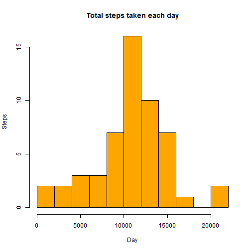
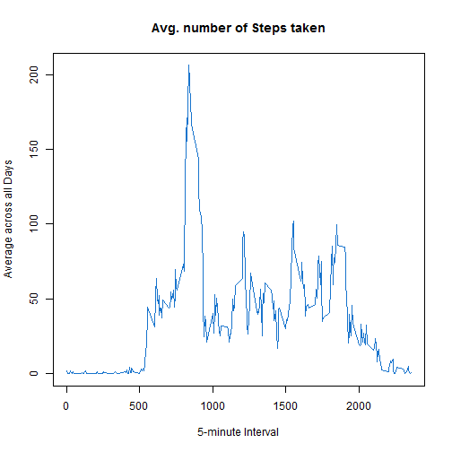
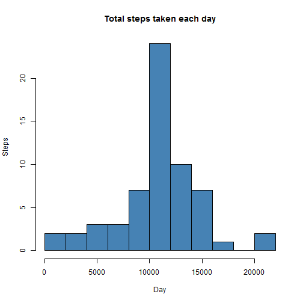
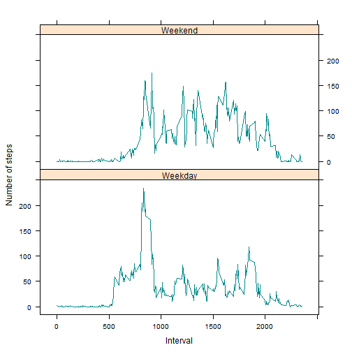

# Reproducible Research: Peer Assessment 1
------------------------------------------

This assignment makes use of data from a personal activity monitoring device. This device collects data at 5 minute intervals through out the day. The data consists of two months of data from an anonymous individual collected during the months of October and November, 2012 and include the number of steps taken in 5 minute intervals each day.
This assignment of mine follows a question and answer format for the questions given in the assignment. [source](https://class.coursera.org/repdata-003/human_grading/view/courses/972142/assessments/3/submissions)

## Loading and preprocessing the data ##

### Load the data (i.e. read.csv()) ###

```r
activity <- read.csv("activity.csv", colClasses = c("numeric", "character", 
    "numeric"))
head(activity)
```

```
##   steps       date interval
## 1    NA 2012-10-01        0
## 2    NA 2012-10-01        5
## 3    NA 2012-10-01       10
## 4    NA 2012-10-01       15
## 5    NA 2012-10-01       20
## 6    NA 2012-10-01       25
```

```r
names(activity) 
```

```
## [1] "steps"    "date"     "interval"
```
### Process/transform the data (if necessary) into a format suitable for your analysis ###

```r
activity$date <- as.Date(activity$date, "%Y-%m-%d")
```

## What is mean total number of steps taken per day? ##

Use aggregate function to aggregate data by Steps and Date

```r
net_steps <- aggregate(steps ~ date, data = activity, sum, na.rm = TRUE)
```
The Histogram representing total steps taken each day

```r
hist(net_steps$steps, main = "Total steps taken each day", xlab = "Day", ylab="Steps", col = "orange", breaks = 15)
```

 

The mean and median respectively

```r
mean_steps<- mean(net_steps$steps)

median_steps <- median(net_steps$steps)
```

## What is the average daily activity pattern? ##

### Make a time series plot (i.e. type = "l") of the 5-minute interval (x-axis) and the average number of steps taken, averaged across all days (y-axis) ###

The '*mean of the steps*' taken and the '*time series plot*'

```r
time_series_data <- tapply(activity$steps, activity$interval, mean, na.rm = TRUE)
```
The time series plot :
*average number of steps taken (averaged across all days) versus the 5-minute intervals*

```r
plot(row.names(time_series_data), time_series_data, type = "l", xlab = "5-minute Interval", 
    ylab = "Average across all Days", main = "Avg. number of Steps taken", col = "dodgerblue3")
```

 
## Which 5-minute interval, on average across all the days in the dataset, contains the maximum number of steps? ##

```r
interval_max_steps <- which.max(time_series_data)
names(interval_max_steps)
```

```
## [1] "835"
```

## Imputing missing values ##

### Calculate and report the total number of missing values in the dataset (i.e. the total number of rows with NAs) ###

```r
missingval_activity <- sum(is.na(activity))
missingval_activity
```

```
## [1] 2304
```

### Devise a strategy for filling in all of the missing values in the dataset. The strategy does not need to be sophisticated. For example, you could use the mean/median for that day, or the mean for that 5-minute interval,etc ###

Using mean for that day to fill in the missing values in the dataset.

```r
steps_mean <- aggregate(steps ~ interval, data = activity, FUN = mean)
replace_missingval <- numeric()
k= nrow(activity)
for (i in 1:k) {
    temp <- activity[i, ]
    if (is.na(temp$steps)) {
        steps <- subset(steps_mean, interval == temp$interval)$steps
    } else {
        steps <- temp$steps
    }
    replace_missingval <- c(replace_missingval, steps)
}
```

### Create a new dataset that is equal to the original dataset but with the missing data filled in. ###

```r
filled_data_activity <- activity
filled_data_activity$steps <- replace_missingval
```
### Make a histogram of the total number of steps taken each day and Calculate and report the mean and median total number of steps taken per day. Do these values differ from the estimates from the first part of the assignment? What is the impact of imputing missing data on the estimates of the total daily number of steps? ###

```r
total_steps <- aggregate(steps ~ date, data = filled_data_activity, sum, na.rm = TRUE)
```
The histgram of total steps taken per day 

```r
hist(total_steps$steps, main = "Total steps taken each day",xlab = "Day",ylab="Steps", col = "steelblue",breaks= 15)
```

 

Calculating the mean and median after replacing missing values

```r
mean(total_steps$steps)
```

```
## [1] 10766
```

```r
median(total_steps$steps)
```

```
## [1] 10766
```
It is observed that the mean has remained the same and the median has changed a little bit.

## Are there differences in activity patterns between weekdays and weekends?

For this part the weekdays() function may be of some help here. Use the dataset with the filled-in missing values for this part.

### Create a new factor variable in the dataset with two levels "weekday" and "weekend" indicating whether a given date is a weekday or weekend day. ###

```r
day <- weekdays(activity$date)
daytype <- vector()
k<- nrow(activity)
for (i in 1:k) {
    if (day[i] == "Saturday") {
        daytype[i] <- "Weekend"
    } else if (day[i] == "Sunday") {
        daytype[i] <- "Weekend"
    } else {
        daytype[i] <- "Weekday"
    }
}
activity$daytype <- daytype
activity$daytype <- factor(activity$daytype)
steps_day <- aggregate(steps ~ interval + daytype, data = activity, mean)
names(steps_day) <- c("interval", "daytype", "steps")
```
### Make a panel plot containing a time series plot (i.e. type = "l") of the 5-minute interval (x-axis) and the average number of steps taken, averaged across all weekday days or weekend days (y-axis). ###

```r
library(lattice)
xyplot(steps ~ interval | daytype, steps_day, type = "l", layout = c(1, 2), 
    xlab = "Interval", ylab = "Number of steps" ,col ="darkcyan")
```

 

Conclusion :
Based on the steps taken per day which is considered as 'activity' , from our observation and evaluation of data and last graph, we can can clearly say that there is more activity on the weekends than on weekdays. This might be due to more free time available on the weekends than on the busy work-loaded weekdays.
